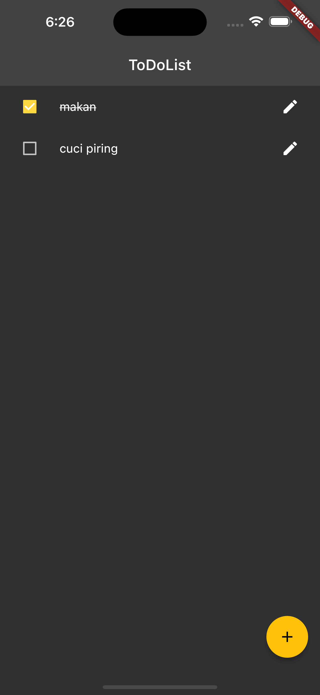
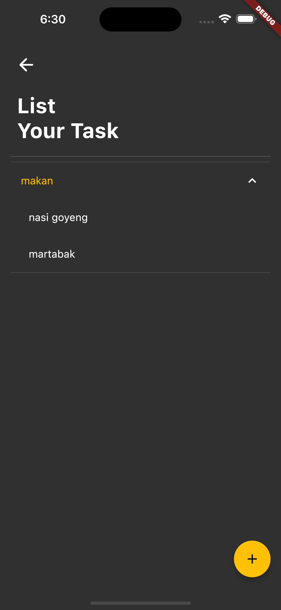
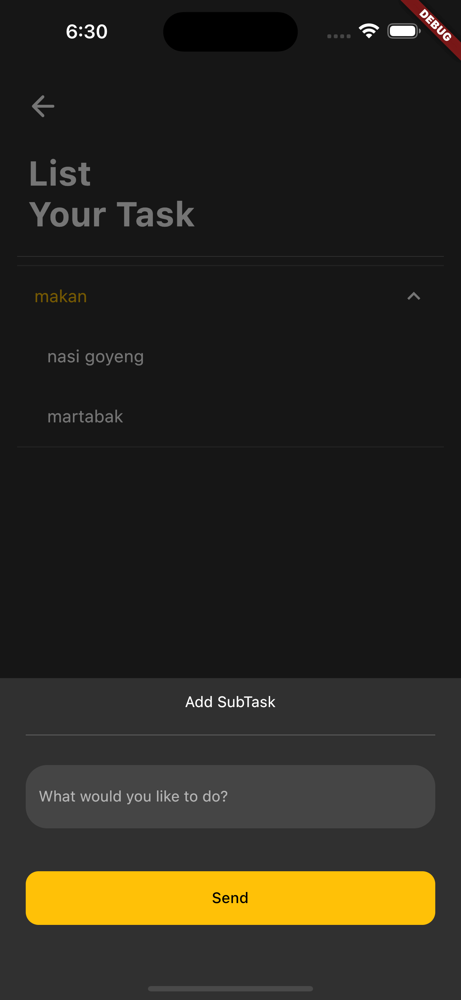
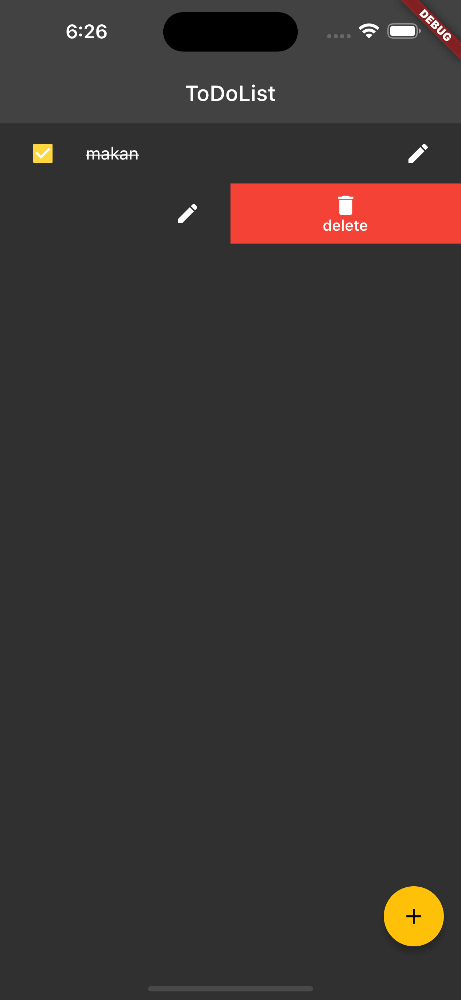
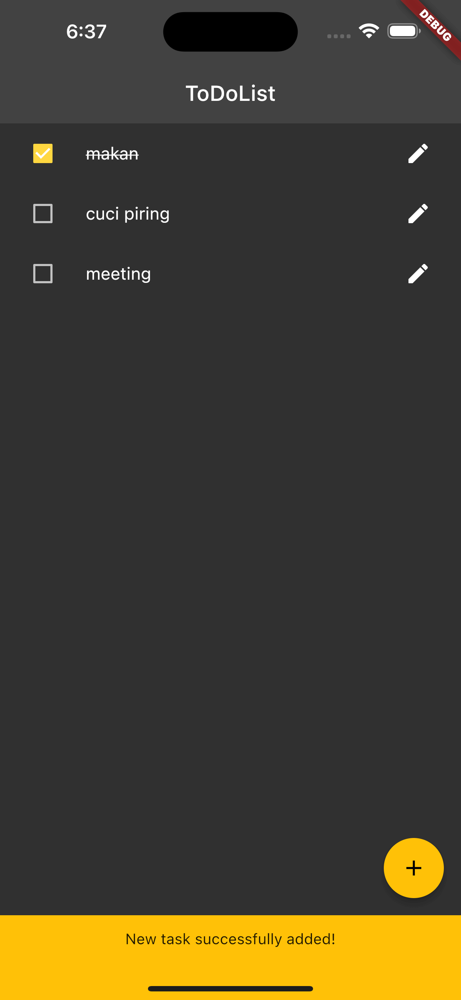
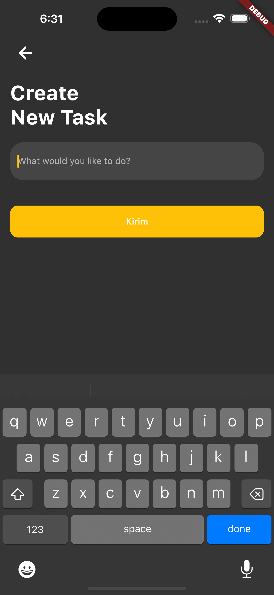
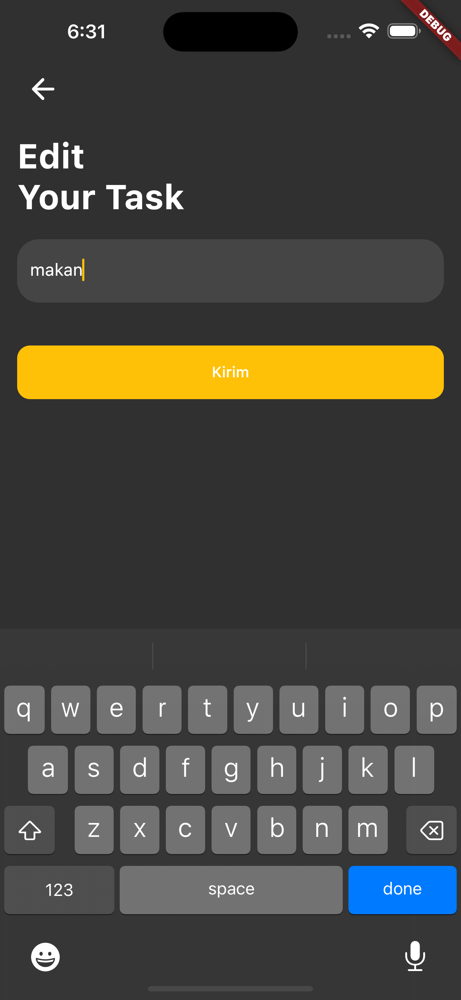

## Description

Projek ini merupakan projek tes masuk pada PT. Lingkar Kreasi dengan deskripsi test seperti berikut.
- Create simple Todo app using Flutter 3+
- App must have at least 2 screen (list, and detail)
- App can add new task
- App can add new subtask
- App can update existing task
- App can delete task
- App can update task is done status on list screen
- App can show task and its subtasks using tree view

## Screenshot

 &nbsp;  &nbsp;  &nbsp;  &nbsp;  &nbsp;  &nbsp;  
